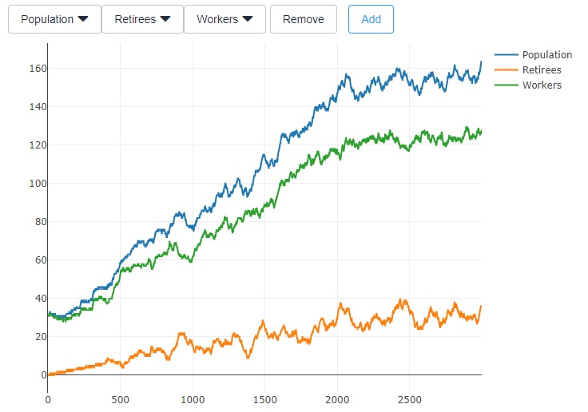
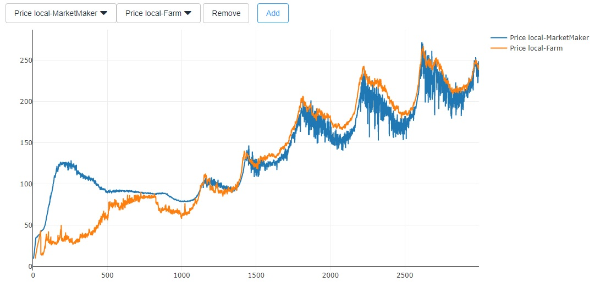

# Exercise 5 - Stocks

In this week's exercise, you should improve the investment strategy of a single agent that is born on day 2499 of a simulation that runs for 3000 days. The population is configured to grow until day 2000, at which day the birth rate is set to 0.2%, corresponding to the mortality. This results in the population dynamics shown in the following chart, that starts following a random walk on day 2000, as the birth rate is probabilistic:

Given that the population stays more or less the same, one could expect more or less stable prices and production. This is indeed the case on the goods market, but not on the stock market. Dividend yields are way too high, inconsistent across firm types, and prices fluctuate wildly:

So the efficient market hypothesis clearly does not hold. How should it? So far, the only active investors in the market follow a trivial equal weight strategy, where they buy each stock with equal probability. Also, the market maker earn nice profits from their market making, but the only follow a mechanistic rule to do so, disregarding all firm fundamentals.

This is a paradise for an active investor! Simply by choosing stocks better, you can enable your agent to lead a luxurious life in comparison to all the others, that only invest passively.

## Task 1: Equilibrium Price

Where do you think is the long-term equilibrium prices of the stocks in our setting? As an agent, how much would you pay for a stock?

Just make a good qualitative argument, no maths needed. The following considerations might help:

* Generally, agents do not discount the future as long as they live. So on the one hand, the discount rate could be seen as 0. However, on the other hand, their life-span is limited to 500 days, so on their last day, they discount the future by 100%.
* Retired agents just sell a fraction of their shares every day, regardless of the price.
* Working agents should buy more shares when they offer high returns, and less when they offer lower returns.
* Working agents cannot invest more than what they earn.

Also, keep it short. Do not spend more than half an hour on this.

## Task 2: Better investing

The provided implementation of the Investor class does the same as everyone else, namely saving as usual and invest the savings using an equal weight strategy.

Your task is to find a better [stock picking strategy](../src/com/agentecon/exercise5/StockPickingStrategy.java). The agent should still follow a buy-and-hold strategy (i.e. not selling any stocks until retirement), but should choose them a little more wisely than in the default. On top of that, feel free to adjust the savings schedule, letting the agent save more than under the default schedule. The original savings schedule is efficient when stocks are priced fairly, but in the configuration at hand, they are insanely cheap! So saving some more makes absolute sense. You do not need to adjust the behavior of the agent in retirement.

## Deliverables and deadline

Document your findings in the [lab journal](exercise05-journal.md) and submit your version of the exercise 5 investor to your repository. The current ranking can be found [here](http://meissereconomics.com/vis/simulation?sim=ex5-stocks).

The deadline for submitting the lab journal to github is 2017-10-26 at 24:00.
